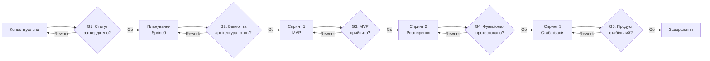

# Життєвий цикл проєкту

## 5.1. Обрана модель життєвого циклу

**Конкретна модель:** Scrum (представник адаптивних моделей).

**Тип моделі за сучасною класифікацією (PMBOK 7):** Адаптивна / Гнучка (Adaptive / Agile).

**Обґрунтування вибору:**
Проєкт має нечітко визначені на старті вимоги до функціоналу — замовник (студентська команда-куратор) очікує отримувати проміжні версії продукту та коригувати пріоритети за результатами демонстрацій. Команда невелика (4–5 осіб), працює в умовах обмеженого й гнучкого бюджету часу (один семестр), що робить недоцільним жорстке фіксування обсягу робіт наперед, як у Waterfall. Технологічний стек (React + Node.js) добре відомий команді, що дозволяє швидко видавати працездатні інкременти вже після перших ітерацій. Високий рівень невизначеності щодо очікувань кінцевих користувачів вимагає раннього й частого зворотного зв'язку, який забезпечують короткі спринти. Відповідно, Scrum дозволяє поєднати керованість (через ворота між фазами) із гнучкістю адаптації до змін вимог.

---

## 5.2. Фази життєвого циклу

| № | Назва фази | Мета фази | Тривалість (тижнів) | Ключові роботи | Deliverables (проміжні результати) | Відповідальний |
|---|---|---|---|---|---|---|
| 1 | Концептуальна (Ініціація) | Визначити цілі проєкту, межі та зацікавлених сторін | 1 | Аналіз ідеї, формулювання цілей, попередній аналіз ризиків, визначення команди | Статут проєкту (Project Charter), список зацікавлених сторін | Керівник проєкту |
| 2 | Планування (Sprint 0) | Сформувати беклог продукту та архітектуру | 1 | Збір вимог, побудова Product Backlog, вибір архітектури, налаштування репозиторію | Product Backlog, схема архітектури, налаштоване середовище розробки | Тімлід / Product Owner |
| 3 | Спринт 1 (MVP) | Реалізувати базовий функціонал (MVP) | 2 | Розробка авторизації, базового CRUD завдань, розгортання CI | Працездатний MVP, звіт демо-показу | Команда розробки |
| 4 | Спринт 2 (Розширення) | Додати розширений функціонал | 2 | Розробка дошки завдань, сповіщень, ролей користувачів | Оновлена версія продукту, оновлений беклог | Команда розробки |
| 5 | Спринт 3 (Стабілізація) | Виправити дефекти, оптимізувати продуктивність | 2 | Тестування, рефакторинг, усунення багів, підготовка документації | Стабільна версія продукту, тест-звіт | QA-інженер / Команда розробки |
| 6 | Завершення | Здати продукт, підбити підсумки | 1 | Фінальне тестування, розгортання на продакшн, ретроспектива | Реліз продукту, фінальний звіт, ретроспективний звіт | Керівник проєкту |

---

## 5.3. Ворота між фазами

| Ворота | Між фазами | Критерії переходу | Можливі рішення |
|---|---|---|---|
| G1 | Фаза 1 → Фаза 2 | Статут проєкту затверджено; цілі та межі проєкту узгоджені з усіма зацікавленими сторонами | Go / Rework / Kill |
| G2 | Фаза 2 → Фаза 3 | Product Backlog сформовано й пріоритезовано; архітектурне рішення обрано; середовище розробки готове | Go / Rework / Kill |
| G3 | Фаза 3 → Фаза 4 | MVP відповідає критеріям приймання (Definition of Done); демонстрація проведена та схвалена Product Owner | Go / Rework / Kill |
| G4 | Фаза 4 → Фаза 5 | Розширений функціонал реалізовано й протестовано; критичних дефектів немає | Go / Rework / Kill |
| G5 | Фаза 5 → Фаза 6 | Продукт стабільний, покриття тестами відповідає нормі; документація готова | Go / Rework / Kill |

---

## 5.4. Візуалізація життєвого циклу

---

## 5.5. Обґрунтування вибору моделі

На вибір моделі життєвого циклу вплинули насамперед характеристики проєкту, визначені в Лабораторній роботі №2: нечітко зафіксовані вимоги на старті, невеликий розмір команди, обмежений термін виконання (один семестр) та потреба у регулярному зворотному зв'язку від замовника. Ці фактори вказують на високий рівень невизначеності, який погано узгоджується з передбачуваними моделями.

Команда розглядала також каскадну (Waterfall) та інкрементну моделі. Waterfall була відхилена через жорстку послідовність фаз і високий ризик пізнього виявлення невідповідності продукту очікуванням користувачів, що критично за обмежений семестровий термін. Інкрементна модель розглядалась як компромісний варіант, однак була відхилена через відсутність вбудованого механізму регулярної переоцінки пріоритетів беклогу, що є важливим для цього проєкту.

Перевагами обраної моделі Scrum для цього проєкту є: можливість демонструвати працездатний продукт після кожного спринту, гнучкість у переприоритезації завдань за результатами зворотного зв'язку, а також природна інтеграція воріт (Sprint Review / Sprint Planning) у цикл ітерацій без додаткової бюрократії.

Серед потенційних ризиків команда виділяє: розмиття меж обсягу робіт (scope creep) через часту зміну пріоритетів та ризик недостатньої дисципліни в невеликій команді без виділеного Scrum Master на повний робочий день. Для мінімізації цих ризиків заплановано фіксувати Definition of Done для кожного спринту, проводити щотижневі короткі синхронізації (стендапи) та закріпити роль Scrum Master ротаційно серед учасників команди.

